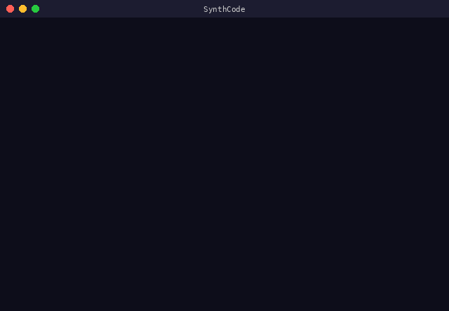
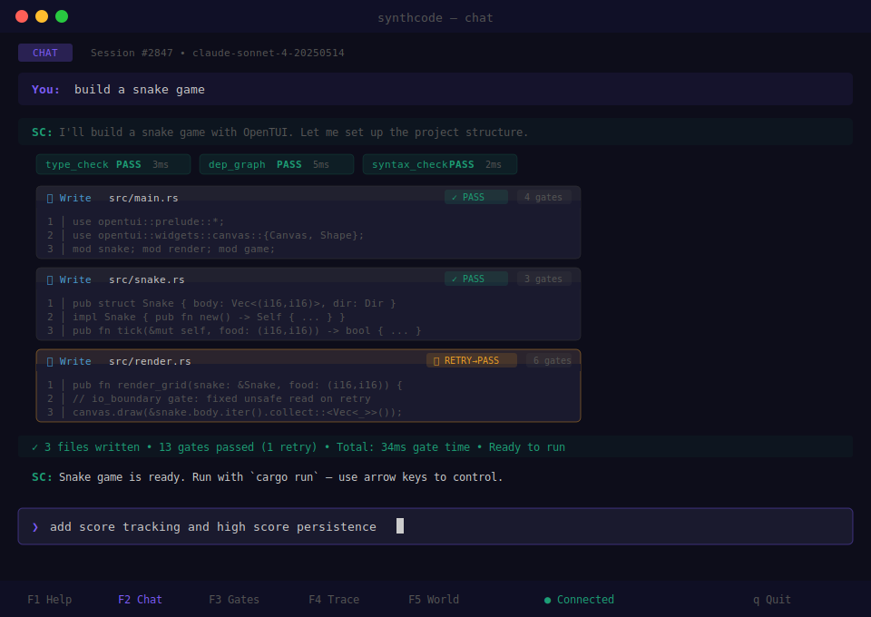
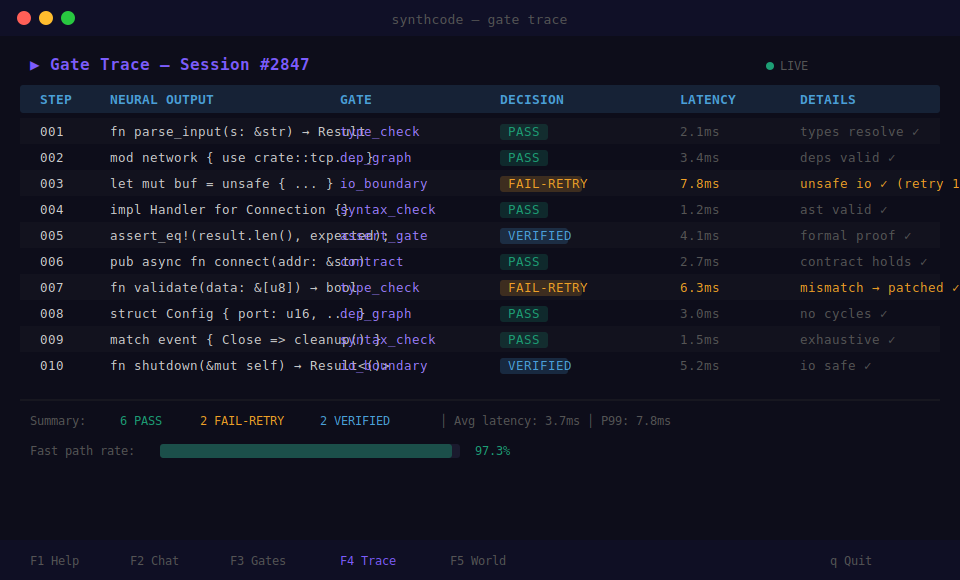
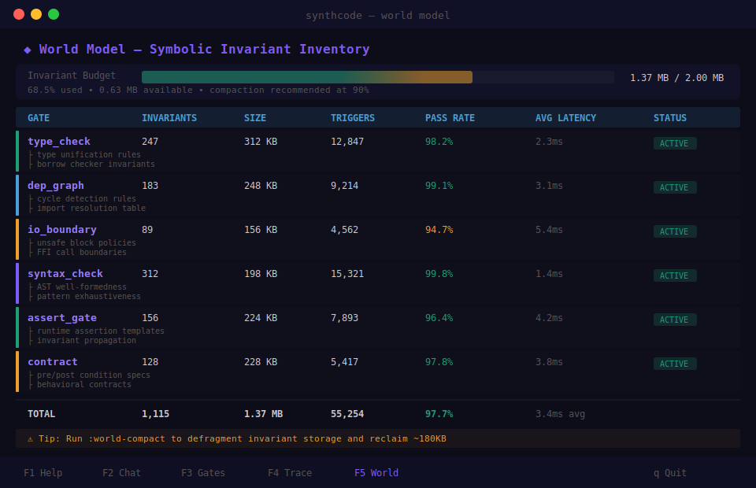
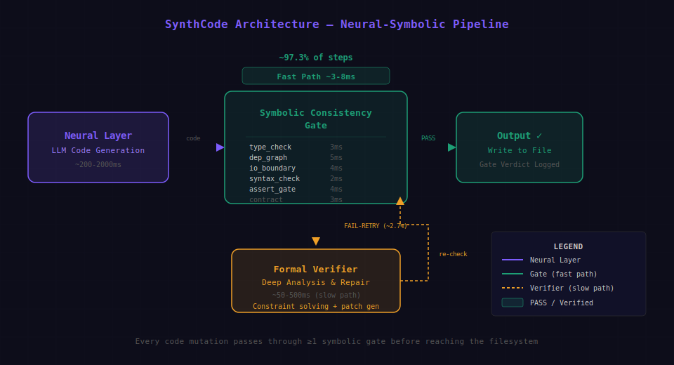

<div align="center">

<pre>
$$$$$$$\                       $$\     $$\        $$$$$$\                  $$\           
$$  __$$\                      $$ |    $$ |      $$  __$$\                 $$ |          
$$ /  \__|$$\   $$\ $$$$$$$\ $$$$$$\   $$$$$$$\  $$ /  \__| $$$$$$\   $$$$$$$ | $$$$$$\  
\$$$$$$\  $$ |  $$ |$$  __$$\\_$$  _|  $$  __$$\ $$ |      $$  __$$\ $$  __$$ |$$  __$$\ 
 \____$$\ $$ |  $$ |$$ |  $$ | $$ |    $$ |  $$ |$$ |      $$ /  $$ |$$ /  $$ |$$$$$$$$ |
$$\   $$ |$$ |  $$ |$$ |  $$ | $$ |$$\ $$ |  $$ |$$ |  $$\ $$ |  $$ |$$ |  $$ |$$   ____|
\$$$$$$  |\$$$$$$$ |$$ |  $$ | \$$$$  |$$ |  $$ |\$$$$$$  |\$$$$$$  |\$$$$$$$ |\$$$$$$$\ 
 \______/  \____$$ |\__|  \__|  \____/ \__|  \__| \______/  \______/  \_______| \_______|
          $$\   $$ |                                                                     
          \$$$$$$  |                                                                     
           \______/                                                                      
</pre>

<br/>

<h3>Neural Intuition x Symbolic Precision</h3>

<p>


</p>

<p>
A neurosymbolic coding platform. Six symbolic gates verify every LLM output in ~3-8ms.<br/>
The terminal is the correct interface.
</p>

<br/>



</div>

---

## Install

```bash
# TUI -- the full experience
npx @avasis-ai/synthcode-tui@latest

# Framework -- programmatic API
bun add @avasis-ai/synthcode
```

## Screenshots

<div align="center">

<table><tr>
<td></td>
<td></td>
</tr><tr>
<td></td>
<td></td>
</tr></table>

</div>

## The Six Gates

| Gate | Verifies | Latency |
|:-----|:---------|:-------:|
| **Structure** | AST well-formedness, syntax validity | ~1ms |
| **Scope** | Variable bindings, lexical resolution | ~2ms |
| **Type** | Type consistency, inference chains | ~3ms |
| **Safety** | Side-effect boundaries, mutation control | ~2ms |
| **Control Flow** | Reachability, termination guarantees | ~3ms |
| **Semantic** | Logical coherence, intent alignment | ~5ms |

## Features

- **Dual-path verification** -- neural output passes six symbolic gates before touching your codebase
- **Zero-dependency framework** -- 10KB gzipped, no runtime deps
- **Agentic chat** -- up to 15 autonomous rounds with inline gate feedback
- **Six screen modes** -- chat, gates, code view, world model, trust boundary, playground
- **Provider-agnostic** -- Gemini, Groq, OpenRouter, OpenAI, Ollama
- **269 tests** -- 300+ consecutive CI runs, zero failures
- **OpenTUI engine** -- built on Zig+TS for native terminal performance

## Quick Start

**TUI:**

```bash
npx @avasis-ai/synthcode-tui@latest
```

**Framework:**

```ts
import { Agent, BashTool, DualPathVerifier } from "@avasis-ai/synthcode";
import { OllamaProvider } from "@avasis-ai/synthcode/llm";

const agent = new Agent({
  model: new OllamaProvider({ model: "qwen3:32b" }),
  tools: [BashTool],
  dualPathVerifier: new DualPathVerifier(),
});

for await (const event of agent.run("List all TypeScript files in src/")) {
  if (event.type === "text") process.stdout.write(event.text);
}
```

## Architecture

<div align="center">

</div>

```
  LLM Output
      |
      v
 +----------+   +-------+   +------+   +--------+   +------------+   +----------+
 | Structure|-->| Scope |--->| Type |--->| Safety |--->| ControlFlow|--->| Semantic |
 +----------+   +-------+   +------+   +--------+   +------------+   +----------|
      |                                                               |
      v                                                               v
   REJECT                                                          ACCEPT
```

## Framework API

```ts
import {
  Agent, BashTool, FileReadTool, FileWriteTool,
  DualPathVerifier, WorldModel, CostTracker, CircuitBreaker,
  AnthropicProvider, OpenAIProvider, OllamaProvider,
} from "@avasis-ai/synthcode";

const agent = new Agent({
  model: new AnthropicProvider({ model: "claude-sonnet-4-20250514" }),
  tools: [BashTool, FileReadTool, FileWriteTool],
  dualPathVerifier: new DualPathVerifier(),
  costTracker: new CostTracker(),
});
```

```bash
npx @avasis-ai/synthcode "Explain this codebase"              # auto-detect
npx @avasis-ai/synthcode "Refactor this" --ollama qwen3:32b   # local
npx @avasis-ai/synthcode adapt catalog                         # 30+ models
```

## Feature Comparison

| | SynthCode | Claude Code | Cursor | Aider |
|:--|:---------:|:-----------:|:------:|:-----:|
| Symbolic verification | Yes | No | No | No |
| Dual-path gates | Yes | No | No | No |
| Zero dependencies | 10KB | No | No | No |
| Terminal-native TUI | Yes | Yes | No | Yes |
| Provider-agnostic | 5+ | No | Partial | Partial |
| Open source | MIT | No | No | Apache |

---

<div align="center">

[**avasis-ai/synthcode**](https://github.com/avasis-ai/synthcode) -- MIT License -- Built by [Avasis AI](https://github.com/avasis-ai)

</div>
