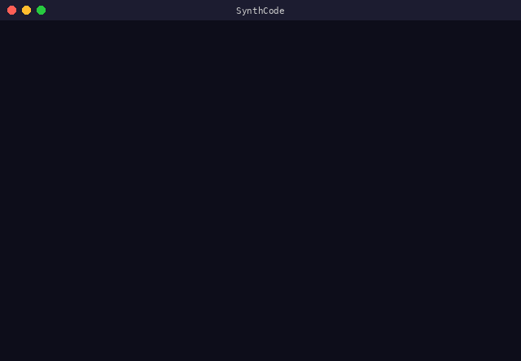
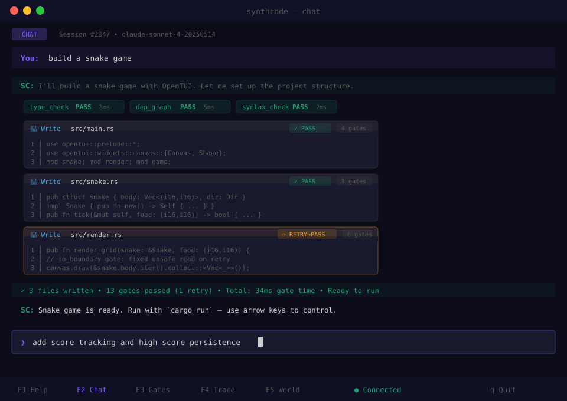
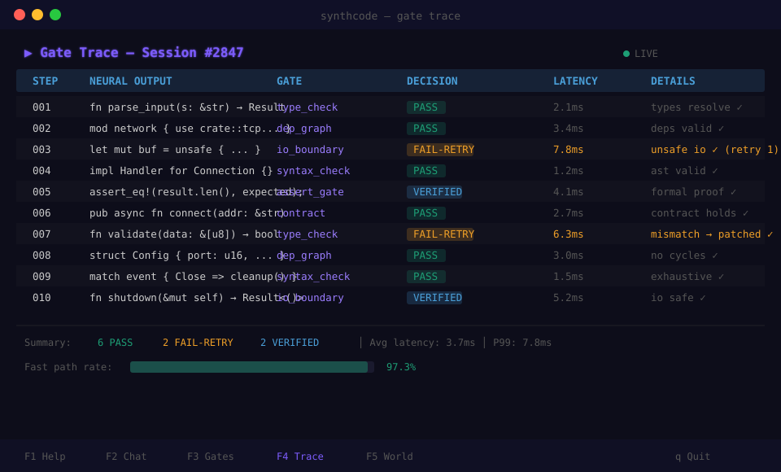
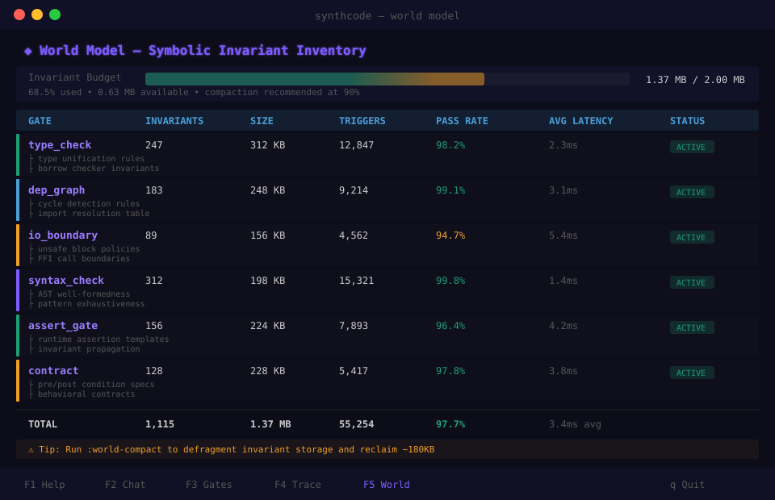
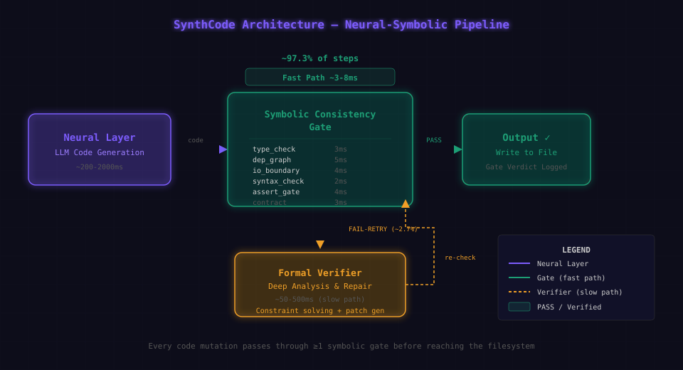

<div align="center">

<pre>
$$$$$$$\                       $$\     $$\        $$$$$$\                  $$\           
$$  __$$\                      $$ |    $$ |      $$  __$$\                 $$ |          
$$ /  \__|$$\   $$\ $$$$$$$\ $$$$$$\   $$$$$$$\  $$ /  \__| $$$$$$\   $$$$$$$ | $$$$$$\  
\$$$$$$\  $$ |  $$ |$$  __$$\\_$$  _|  $$  __$$\ $$ |      $$  __$$\ $$  __$$ |$$  __$$\ 
 \____$$\ $$ |  $$ |$$ |  $$ | $$ |    $$ |  $$ |$$ |      $$ /  $$ |$$ /  $$ |$$$$$$$$ |
$$\   $$ |$$ |  $$ |$$ |  $$ | $$ |$$\ $$ |  $$ |$$ |  $$\ $$ |  $$ |$$ |  $$ |$$   ____|
\$$$$$$  |\$$$$$$$ |$$ |  $$ | \$$$$  |$$ |  $$ |\$$$$$$  |\$$$$$$  |\$$$$$$$ |\$$$$$$$\ 
 \______/  \____$$ |\__|  \__|  \____/ \__|  \__| \______/  \______/  \_______| \_______|
          $$\   $$ |                                                                     
          \$$$$$$  |                                                                     
           \______/                                                                      
</pre>

<br/>

<h3>Neural Intuition x Symbolic Precision</h3>

<p>


</p>

<p>
A neurosymbolic coding platform. Six symbolic gates verify every LLM output in ~3-8ms.<br/>
The terminal is the correct interface.
</p>

<br/>



</div>

---

## Install

```bash
# TUI -- the full experience
npx @avasis-ai/synthcode-tui@latest

# Framework -- programmatic API
bun add @avasis-ai/synthcode
```

## Screenshots

<div align="center">

<table><tr>
<td></td>
<td></td>
</tr><tr>
<td></td>
<td></td>
</tr></table>

</div>

## The Six Gates

| Gate | Verifies | Latency |
|:-----|:---------|:-------:|
| **Structure** | AST well-formedness, syntax validity | ~1ms |
| **Scope** | Variable bindings, lexical resolution | ~2ms |
| **Type** | Type consistency, inference chains | ~3ms |
| **Safety** | Side-effect boundaries, mutation control | ~2ms |
| **Control Flow** | Reachability, termination guarantees | ~3ms |
| **Semantic** | Logical coherence, intent alignment | ~5ms |

## Features

- **Dual-path verification** -- neural output passes six symbolic gates before touching your codebase
- **Zero-dependency framework** -- 10KB gzipped, no runtime deps
- **Agentic chat** -- up to 15 autonomous rounds with inline gate feedback
- **Six screen modes** -- chat, gates, code view, world model, trust boundary, playground
- **Provider-agnostic** -- Gemini, Groq, OpenRouter, OpenAI, Ollama
- **269 tests** -- 300+ consecutive CI runs, zero failures
- **OpenTUI engine** -- built on Zig+TS for native terminal performance

## Quick Start

**TUI:**

```bash
npx @avasis-ai/synthcode-tui@latest
```

**Framework:**

```ts
import { Agent, BashTool, DualPathVerifier } from "@avasis-ai/synthcode";
import { OllamaProvider } from "@avasis-ai/synthcode/llm";

const agent = new Agent({
  model: new OllamaProvider({ model: "qwen3:32b" }),
  tools: [BashTool],
  dualPathVerifier: new DualPathVerifier(),
});

for await (const event of agent.run("List all TypeScript files in src/")) {
  if (event.type === "text") process.stdout.write(event.text);
}
```

## Architecture

<div align="center">

</div>

```
  LLM Output
      |
      v
 +----------+   +-------+   +------+   +--------+   +------------+   +----------+
 | Structure|-->| Scope |--->| Type |--->| Safety |--->| ControlFlow|--->| Semantic |
 +----------+   +-------+   +------+   +--------+   +------------+   +----------|
      |                                                               |
      v                                                               v
   REJECT                                                          ACCEPT
```

## Framework API

```ts
import {
  Agent, BashTool, FileReadTool, FileWriteTool,
  DualPathVerifier, WorldModel, CostTracker, CircuitBreaker,
  AnthropicProvider, OpenAIProvider, OllamaProvider,
} from "@avasis-ai/synthcode";

const agent = new Agent({
  model: new AnthropicProvider({ model: "claude-sonnet-4-20250514" }),
  tools: [BashTool, FileReadTool, FileWriteTool],
  dualPathVerifier: new DualPathVerifier(),
  costTracker: new CostTracker(),
});
```

```bash
npx @avasis-ai/synthcode "Explain this codebase"              # auto-detect
npx @avasis-ai/synthcode "Refactor this" --ollama qwen3:32b   # local
npx @avasis-ai/synthcode adapt catalog                         # 30+ models
```

## Agent Patterns

SynthCode is designed for autonomous agents that run 24/7. Here are common patterns:

### Error Handling & Resilience

Autonomous agents must handle failures gracefully:

```ts
import { createResilientTool, ErrorLogger, CircuitBreaker } from "@avasis-ai/synthcode";

// Wrap tools with retry logic and circuit breaking
const bashTool = createResilientTool(
  new BashTool(),
  new ErrorLogger(),
  new CircuitBreaker(),
  { maxRetries: 3 }
);

// The agent continues even when tools fail temporarily
```

See [examples/error-handling.ts](examples/error-handling.ts) for a complete implementation with:
- Automatic retry with exponential backoff
- Circuit breaker pattern for failing tools
- Structured error logging for debugging
- Graceful degradation when tools are unavailable

### Continuous Monitoring

Track agent performance over time:

```ts
const costTracker = new CostTracker();
const agent = new Agent({
  model: anthropic("claude-3-5-sonnet-20241022"),
  tools: [BashTool, FileReadTool],
  costTracker, // Tracks tokens, cost, and usage metrics
});

// Get stats anytime
const stats = costTracker.getStats();
console.log(`Total cost: $${stats.totalCost}`);
```

### Memory & Context

Persistent memory for long-running agents:

```ts
import { SQLiteStore } from "@avasis-ai/synthcode/memory";

const memory = new SQLiteStore({ path: "./agent-memory.db" });

// Agent remembers conversations across restarts
const agent = new Agent({
  model: anthropic("claude-3-5-sonnet-20241022"),
  tools: [BashTool],
  memory, // Persist context to disk
});
```

### Autonomous Loops

Run agents continuously:

```ts
import { agentLoop } from "@avasis-ai/synthcode";

for await (const result of agentLoop(agent, {
  maxTurns: 15,
  timeout: 5 * 60 * 1000, // 5 minute timeout
  onTurn: async (turn, events) => {
    // Hook into each turn for monitoring
    console.log(`Turn ${turn}:`, events.length, "events");
  }
})) {
  if (result.done) break;
  // Continue loop
}
```

### Examples

- [examples/autonomous-agent.ts](examples/autonomous-agent.ts) - CI/CD automation and issue fixing
- [examples/error-handling.ts](examples/error-handling.ts) - Resilient error handling patterns
- [examples/coding-agent.ts](examples/coding-agent.ts) - Codebase refactoring
- [examples/basic.ts](examples/basic.ts) - Simple tool usage
- [examples/demo.ts](examples/demo.ts) - Full feature demonstration

## Feature Comparison

| | SynthCode | Claude Code | Cursor | Aider |
|:--|:---------:|:-----------:|:------:|:-----:|
| Symbolic verification | Yes | No | No | No |
| Dual-path gates | Yes | No | No | No |
| Zero dependencies | 10KB | No | No | No |
| Terminal-native TUI | Yes | Yes | No | Yes |
| Provider-agnostic | 5+ | No | Partial | Partial |
| Open source | MIT | No | No | Apache |

---

<div align="center">

[**avasis-ai/synthcode**](https://github.com/avasis-ai/synthcode) -- MIT License -- Built by [Avasis AI](https://github.com/avasis-ai)

</div>

---

## ⚡ SynthCode Pro

**8 verification gates that catch AI hallucinations in 7.2ms.**

The OSS version has 6 gates. Pro adds:
- **Gate 7: Self-Consistency** — samples multiple completions, checks agreement
- **Gate 8: Red-Team Adversarial** — adversarial prompt stress-tests every response
- **Neurosymbolic Router** — auto-routes between neural and symbolic execution
- **Knowledge Graph + Episodic Memory** — persistent context across sessions
- **Production Toolkit** — OpenTelemetry, rate limiting, semantic caching, fallback chains
- **5 Agent Templates** — research, coding, support, analysis, multi-agent orchestration

269 tests passing. Full TypeScript source. Ships on npm (`@avasis-ai/synthcode-pro`).

**Plans:**
| Tier | Price | Includes |
|------|-------|----------|
| [Starter](https://whop.com/checkout/plan_Hy5WG4oOZyRHV) | $49 | 6 core gates + 5 templates + docs |
| [Full Access](https://whop.com/checkout/plan_KspZxhIoW87gd) | $149 | All 8 gates + router + memory + toolkit |
| [Complete Bundle](https://whop.com/checkout/plan_H1Xjpw7in99e4) | $199 | Pro + 500 Prompts + AI Lab Lifetime |

**Launch promo:** Use `LAUNCH20` for $30 off Full Access → **$119** · `FIRST10` for $75 off → **$74** (first 10 buyers)

→ **[Get SynthCode Pro](https://whop.com/checkout/plan_KspZxhIoW87gd?promo=LAUNCH20)**

---

### More from Avasis

- **[500 AI Agent Prompts](https://whop.com/checkout/plan_NQ8bSG4DerAmZ)** — 500+ production prompts for coding, research, support, data analysis ($9)
- **[Avasis AI Lab](https://whop.com/checkout/plan_uLqdAkBLRtzS6)** — Free community for AI agent developers

